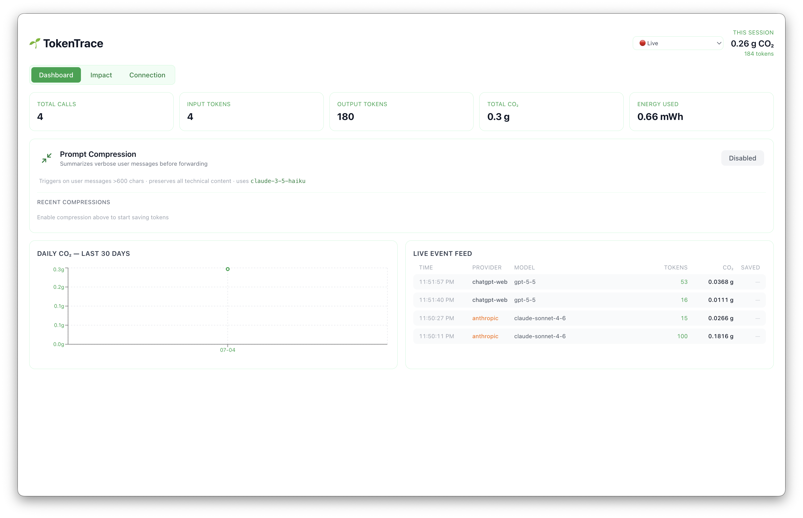
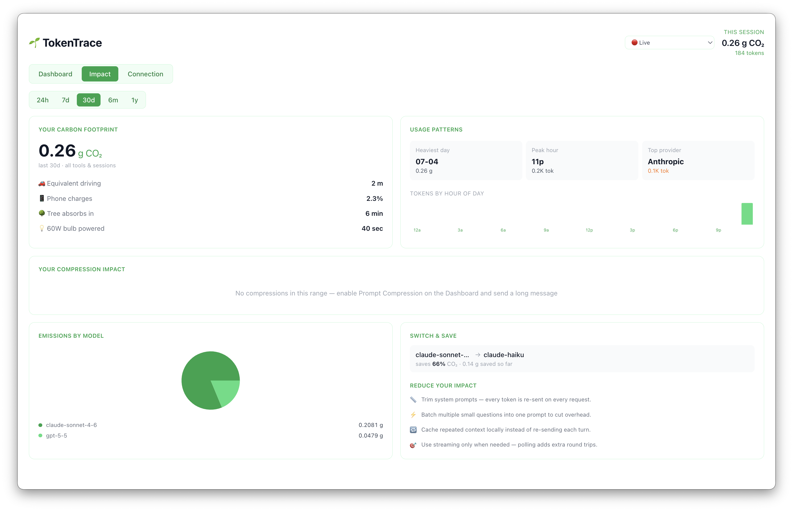

# TokenTrace

Originally built for WiCS Hack to the Beat 2026 @ UVA by Anmol Thapa, Shaunak Dogra, and Ekamjot Singh.

## What it is

TokenTrace is an Electron desktop app that sits between your AI tools and their upstream APIs. It intercepts every request, extracts token counts, calculates CO2 emissions using per-model energy profiles, and surfaces everything in a live dashboard. One-click connect writes the proxy URL directly into your Claude Code or Codex config so you do not have to touch anything manually.




## Features

### Proxy and interception

- Local proxy server on port 3001 intercepts API calls from Claude Code, Codex CLI, and any SDK-based app pointing at it
- Streams responses back to the client with no added latency
- Extracts token usage from both regular and streaming (SSE) responses
- Crash recovery: if the app was force-killed, stale proxy URLs are cleaned up on next launch

### Emissions tracking

- Per-model energy profiles (Haiku, Sonnet, Opus, GPT-4o, etc.)
- CO2 grams calculated per request using grid carbon intensity estimates
- Comparisons shown in human-readable terms (e.g. equivalent to driving X meters)

### Dashboard

- Live event feed showing each request as it comes in
- Historical charts by day
- Model breakdown across providers
- Session stats: total tokens, total CO2, request count

### One-click connections

- Claude Code: writes `ANTHROPIC_BASE_URL` into `~/.claude/settings.json`
- Codex CLI: writes `openai_base_url` into `~/.codex/config.toml`
- Gemini CLI: writes `GEMINI_BASE_URL` into `~/.env`
- Preferences are persisted so connections are restored automatically on next launch

### Chrome extension

- Tracks token usage from claude.ai and ChatGPT in the browser (where API calls are not interceptable via proxy)
- Posts events to the desktop app on port 3002, feeding them into the same dashboard and DB

### Prompt compression (experimental)

- Optional compression pass on outgoing prompts to reduce token count
- Desktop notification shown when a prompt is compressed, with token savings estimate

## Tech stack

- Electron + electron-vite
- React 18, Tailwind CSS, Recharts
- Express (proxy server, extension receiver)
- NDJSON flat-file database (no external DB required)

## Setup

### Desktop app

Requires Node.js 18+ and macOS (the proxy config paths and process management use macOS conventions).

```bash
cd tokentrace
npm install
npm run dev
```

To build a packaged app:

```bash
npm run build
npm run package
```

### Chrome extension

1. Open Chrome and go to `chrome://extensions`
2. Enable **Developer mode** (top right toggle)
3. Click **Load unpacked**
4. Select the `tokentrace-extension/` folder from this repo

The extension connects to the desktop app on `localhost:3002`. The desktop app must be running for extension events to be recorded.

## Notes

- macOS only. The app writes to `~/.claude/settings.json`, `~/.codex/config.toml`, and `~/.env` and uses `pkill` to restart CLI tools after config changes. These paths and commands are macOS/Linux specific.
- No account or API key required. Everything is local.
- The NDJSON database is stored in Electron's userData directory (`~/Library/Application Support/tokentrace/` on macOS).
